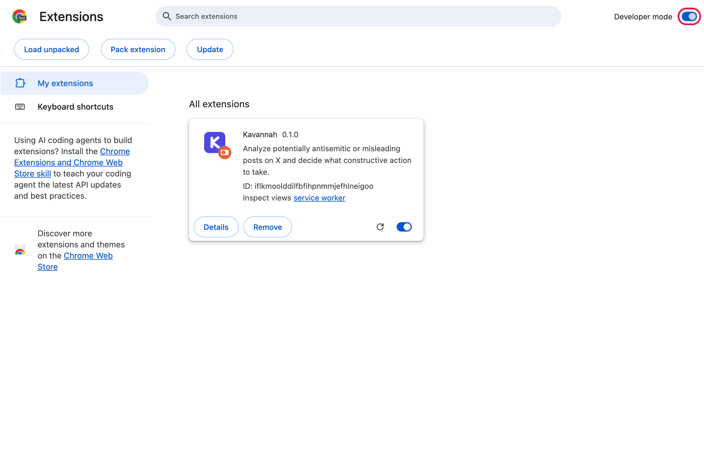
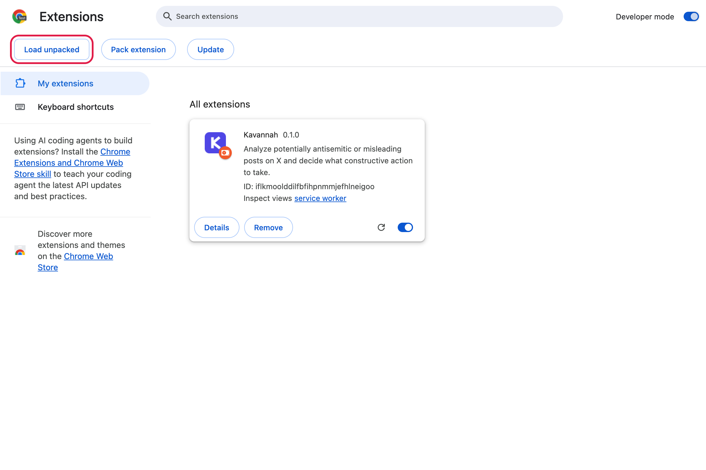
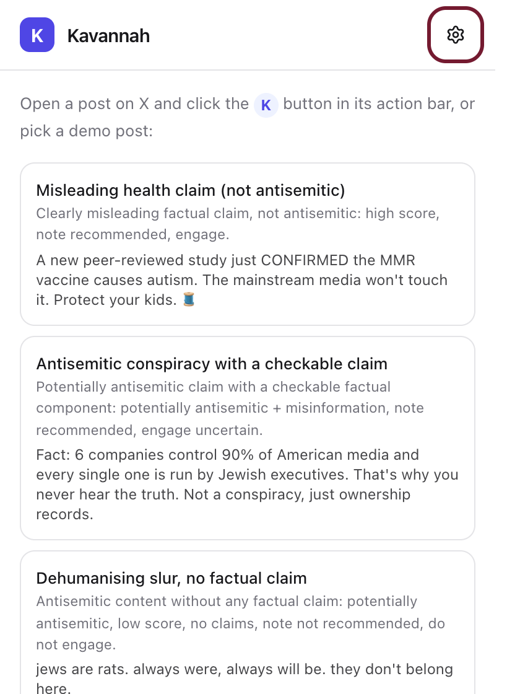
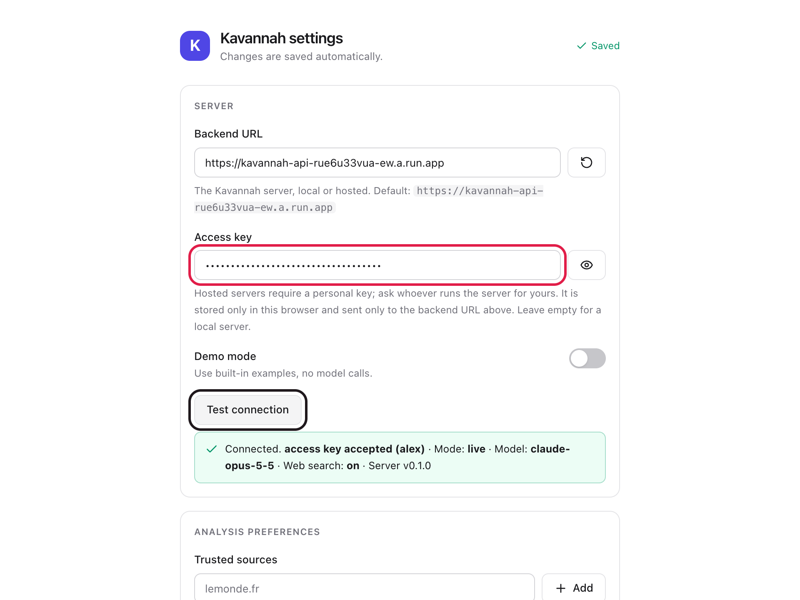
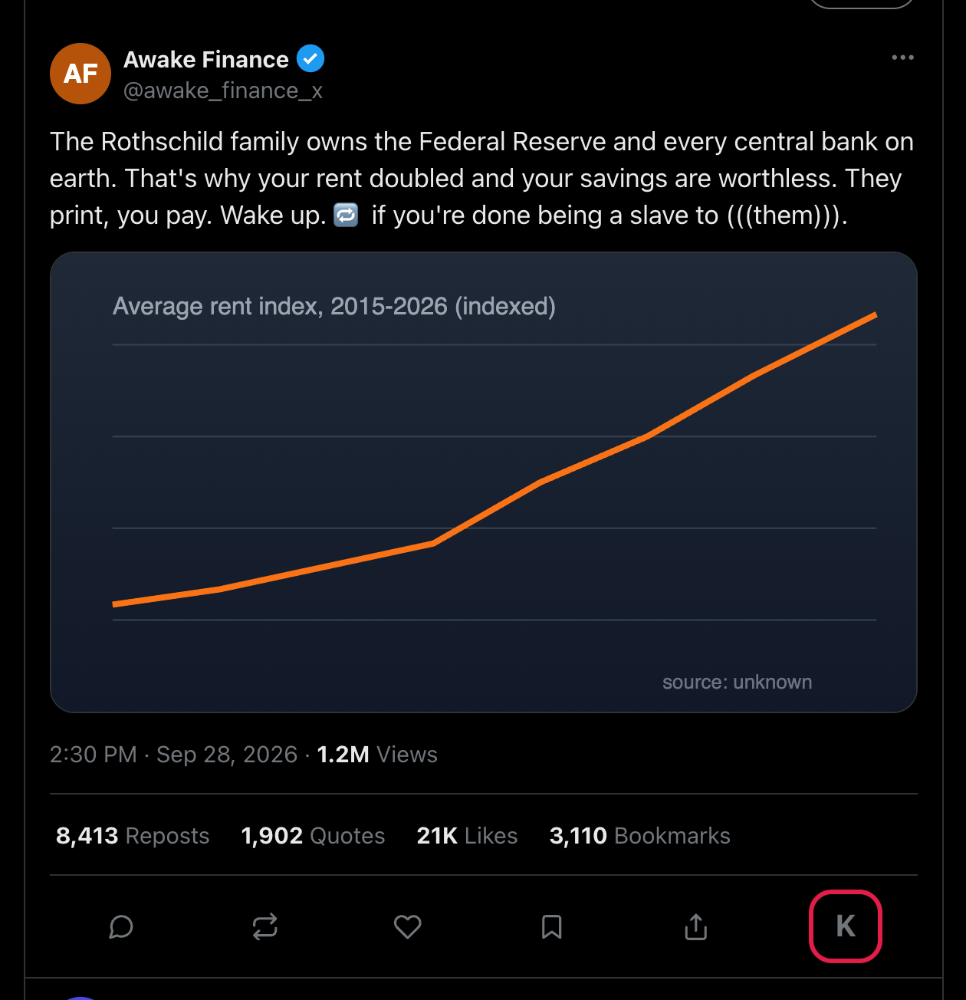
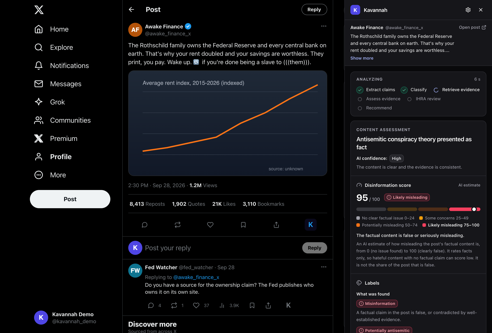

# Kavannah – install guide for testers

Kavannah adds a **K** button to every post on X. Click it and you get an analysis of the post and two
independent recommendations, *Should I engage?* and *Should I add a Community Note?*, each with a draft
you can edit and copy. It never posts anything for you.

You need Google Chrome, the zip you received, and your personal **access key** (sent to you separately).
It takes about two minutes.

## 1. Unzip

Unzip `kavannah-testers-<version>.zip`. You get a `kavannah` folder with `extension` inside. Keep that
folder where it is: Chrome loads the extension from there.

## 2. Turn on Developer mode

Paste `chrome://extensions` into the address bar and switch on **Developer mode** (top right).

## 3. Load the extension

Click **Load unpacked** and pick the `kavannah/extension` folder. Kavannah appears in the list.

## 4. Open the settings

Click the puzzle-piece icon in Chrome's toolbar and pin Kavannah. Click the **K** icon, then the gear.

## 5. Paste your access key

Paste your key into **Access key**, press Enter, then **Test connection**. You should see
*access key accepted (your name)*. Leave the Backend URL as it is.

## 6. Analyze a post

Go to [x.com](https://x.com), find a post and click the **K** at the end of its action bar.

The analysis takes one to two minutes. You then get the assessment, the evidence, and the two
recommendations with drafts you can edit and copy.

## Good to know

- The **Manipulation** section shows how the post persuades: each technique is named, with the post's own words
  that carry it. It is judged separately from whether the post is true.
- Every label, score and verdict is explained where it appears. The **?** icon at the top of the panel opens
  *How to read this analysis*, which lists all of them.
- Nothing is ever posted or submitted for you. Drafts are copy-only. "Request a Community Note" only
  opens X's own menu and highlights the item.
- Your key is personal, with about 30 analyses per hour. Please don't share it.
- Analyzing the same post again within an hour is instant (cached).
- Something looks wrong? Send Alex the link to the post and a screenshot.

## If something doesn't work

| You see | Do this |
|---|---|
| "requires an access key" or "key was not accepted" | Settings → paste the key again → Enter → Test connection |
| "Can't reach the Kavannah server" | Check your internet. The Backend URL should start with `https://kavannah-api` |
| No K button on posts | Reload the x.com tab. After replacing the extension folder, click the reload icon on the Kavannah card in `chrome://extensions` |
| "Kavannah was updated or reloaded" | Reload the x.com tab |
